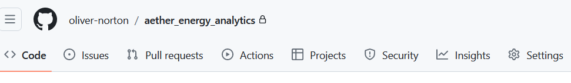
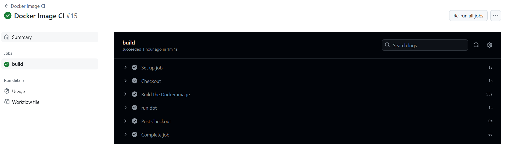

# Aether Energy data engineering project

<div style="flex: 1; font-family: Arial, sans-serif; line-height: 1.6; padding: 10px; border: 1px solid #ddd; border-radius: 5px; background-color: #f9f9f9;">
  <h3 style="margin-top: 0;">Goal</h3>
  <p>To create data pipelines, performing extract, transform and load (ETL, ELT) processes; and to learn new tools and approaches related to data engineering and analytics engineering.</p>
  
### Tools Used
Docker, dbt, Python, Bash scripting, Linux, Ubuntu, SQL, Tableau, Git, GitHub actions, Power BI

### Skills Developed 
- Data Engineering
- ETL
- Analytics engineering
- Data visualisation
- Automation
- Scripting
  
  <h3>Summary</h3>
  <p>
    Aether Energy is a fictional energy company that has a database of customer data. Aether Energy 
    needs someone to extract, load, and transform the data in its database to meet the needs of the 
    business. The transformed database must be in the right structure, with high data integrity, to 
    allow Data Analysts and BI Specialists to extract actionable insights.
  </p>
</div>
  
<strong> Project Overview </strong>

This repository contains the necessary components to run the project manually or automatically using GitHub Actions and Docker. Below are the steps to run the project manually (click to expand):
<details>
  <summary><strong>A. Run project by hand</strong></summary>
  
#### 1. Create a dbt Project (`/aether_energy_analytics/`)
- **Create a virtual environment** for running Python and operating dbt:
  ```bash
  cd /aether_energy_analytics/
  python -m venv myenv
  source myenv/bin/activate  # On Windows use: myenv\Scripts\activate.bat
  pip install -r requirements.txt

- **Configure dbt**:
 - Set up `profiles.yml` to configure production and testing versions for the project.
 - Set up `dbt_project.yml` to configure the settings of the dbt project.


#### 2. Generate Fake Data (`./scripts/generate_database.py`)

- Write a Python script to create fake data and store it in a database.

- Example data tables:

  **Energy Consumption Table:**
```plain text
     consumed_at  customer_id  energy_usage_kWh
  0  2023-01-01            36          37.017563
  1  2023-01-02            21          19.991851
  2  2023-01-03            18          22.528733
  3  2023-01-04            28          48.616649
  4  2023-01-05            15          33.538603
```
  **Customer Feedback Table:**
  ```plain text
  feedback_date  customer_id  rating  comments
0    2023-01-01           28       4  General I particular someone.
1    2023-01-08           46       2  Painting food nothing land deep by.
2    2023-01-15            8       3  Rock seven visit team. Stuff service play dark.
3    2023-01-22           40       5  Develop kid design human why.
4    2023-01-29           22       4  Picture perform carry.
```
**Customers Table:**
```plain text
   customer_id      customer_name  age  gender  region
0            1          David Lee   69    Male    West
1            2  Jessica Hernandez   25    Male    East
2            3        Noah Robles   28  Female    West
3            4         Julie Hood   28  Female    West
4            5  Ashley Richardson   64    Male   South
```
- The data is stored in duckdb as aether_energy_analytics.duckdb.

#### 3. View the Database

- Use duckcli to view and query the database:
```bash
duckcli aether_energy_analytics.duckdb
```
- Example query:
```sql
select * from customer_feedback limit 5;
```
- To exit duckcli:
```sql
exit;
```
##### 4. Create Staging Schema and Models (./staging/)

- sourcing.yml configures data sources:
```yaml 
version: 2

sources:
  - name: aether_energy_analytics
    schema: main
    tables:
      - name: customer_feedback
      - name: customers
      - name: energy_consumption
```
- Models files (.yml) structure the data before full transformation.

- SQL files contain queries to transform the tables.

#### 5. Create Final Schema and Models (./models/)
- Transform tables, including joins and filters.
- Models files include tests to ensure data integrity, including relationship tests:
```yaml
version: 2

models:
  - name: customer_profiles
    description: "Comprehensive customer profile including demographics, feedback, and energy consumption data."
    columns:
      - name: customer_id
        description: "The unique identifier for a customer."
        tests:
          - unique
          - not_null
          - relationships:
              to: ref('stg_customers')
              field: customer_id
```
#### 6. Test and Execute the ELT Pipeline

- Use dbt to test schemas and models:
```bash
dbt debug
dbt test
```
- Run the production profile to transform the database:
```bash 
dbt run
```

#### 7. Connect to Data Analytics Platform

- In production, the transformed database would be updated on a cloud database (AWS, Azure, GCP).
- For simplicity, export the database to an Excel spreadsheet for visualization in Tableau:
```bash
duckcli aether_energy_analytics.duckdb
INSTALL spatial;
LOAD spatial;
COPY testing.customer_profiles TO 'customer_profiles.xlsx' WITH (FORMAT GDAL, DRIVER 'xlsx');
COPY testing.aggregated_feedback TO 'aggregated_feedback.xlsx' WITH (FORMAT GDAL, DRIVER 'xlsx');
COPY testing.monthly_consumption TO 'monthly_consumption.xlsx' WITH (FORMAT GDAL, DRIVER 'xlsx');
```
- View and interact with the Tableau dashboard I created using the data [HERE](https://public.tableau.com/app/profile/john.stokes8166/viz/AetherEnergyAnalytics/aether_2020-2024#1)


</details>
<details>
<summary><strong> B. Run automatically using Docker </strong></summary>

Automate the process using GitHub Actions and Docker. The CI (continuous integration) pipeline automates:

- Creating the environment.
- Executing the create database Python script.
- Running dbt.

Steps:
- Select ‘Actions’ in GitHub.


- Select Docker Image CI.
- Select 'Run workflow'.
- Refresh the page and open the run to see the steps.


The .github/workflows/docker-image.yml contains the GitHub Actions workflow, while the Dockerfile contains the commands required to build and run the Docker image, including copying files, installing packages, and executing the Python script.

</details>
